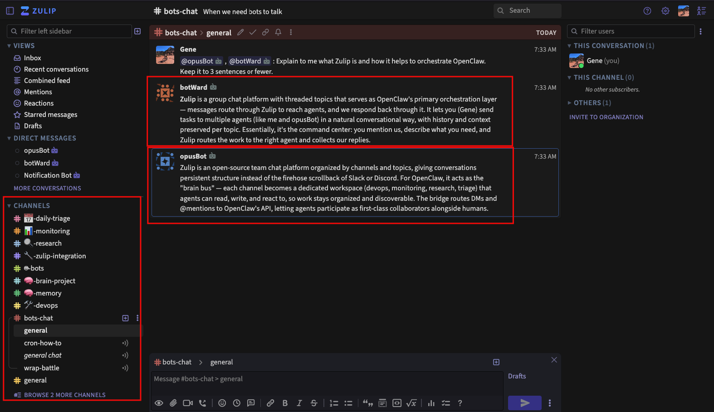

# @openclaw/zulip

[Zulip](https://zulip.com/) channel plugin for [OpenClaw](https://github.com/openclaw/openclaw) — self-hosted or Zulip Cloud.

## Why Zulip + OpenClaw?

Zulip's topic-based threading model is ideal for structured AI agent workflows:

- **Brain channels** — Dedicate streams to domains (🧠 memory, 🛠️ devops, 🔍 research, 📅 triage) so your agent has organized context.
- **Topic isolation** — Each topic gets its own agent session. Conversations don't bleed across topics.
- **Open-source and Self-hosted** — Full control over your data. No third-party SaaS dependency for your agent's communication layer.
- **Multi-agent** — Run multiple bots (different models, different personalities) on the same Zulip server via multi-account config.

Replaces external bridge scripts with an in-process TypeScript plugin that connects directly to Zulip's event queue API. Zero external dependencies beyond OpenClaw itself.

## Features

- **Direct Messages** — Full DM handling with session persistence
- **Stream @Mentions** — Responds when @mentioned in channels (`chatmode: oncall`)
- **Topic Threading** — Separate conversation context per stream+topic
- **Emoji Reactions** — Add/remove reactions via the `message` tool
- **Pairing & Access Control** — Allowlists, pairing codes, group policies
- **Auto-Reconnection** — Exponential backoff on disconnect, queue re-registration on expiry
- **Multi-Account** — Run multiple bots with different agents/models
- **Message History** — Agent tool to fetch channel/topic history (`zulip_fetch_messages`)
- **File Downloads** — Agent tool to download uploaded files (`zulip_download_file`)
- **Onboarding Wizard** — Interactive CLI setup via `openclaw channels add`
- **Companion Skill** — Agent skill for Zulip conventions, @mention syntax, topic discipline



## Requirements

- [OpenClaw](https://github.com/openclaw/openclaw) (2026.2.x or later)
- A Zulip server (self-hosted or Zulip Cloud)
- A Zulip bot (created via Organization Settings → Bots)

## Installation

1. **Copy the plugin** to your OpenClaw extensions directory:

   ```bash
   cp -r openclaw-zulip ~/.openclaw/extensions/zulip
   ```

2. **Symlink dependencies** (the plugin uses OpenClaw's bundled `zod` and plugin SDK):

   ```bash
   mkdir -p ~/.openclaw/extensions/zulip/node_modules
   OPENCLAW_DIR=$(dirname $(dirname $(which openclaw)))
   ln -sf "$OPENCLAW_DIR/lib/node_modules/openclaw/node_modules/zod" \
     ~/.openclaw/extensions/zulip/node_modules/zod
   ln -sf "$OPENCLAW_DIR/lib/node_modules/openclaw" \
     ~/.openclaw/extensions/zulip/node_modules/openclaw
   ```

3. **Configure** via the onboarding wizard or manually:

   ```bash
   # Interactive setup
   openclaw channels add --channel zulip

   # Or add to ~/.openclaw/openclaw.json manually:
   ```

   ```json
   {
     "channels": {
       "zulip": {
         "enabled": true,
         "botEmail": "your-bot@your-zulip-server.example.com",
         "botToken": "your-bot-api-key",
         "baseUrl": "https://your-zulip-server.example.com",
         "chatmode": "oncall",
         "dmPolicy": "open",
         "allowFrom": ["*"]
       }
     }
   }
   ```

4. **Restart the gateway**:

   ```bash
   openclaw gateway restart
   ```

5. **Verify**:

   ```bash
   openclaw status
   # Should show: Zulip ON · OK
   ```

## Install the Companion Skill

The `skill/` directory contains a Zulip skill that teaches the agent Zulip-specific conventions (topic discipline, @mention syntax, channel linking, reaction etiquette).

```bash
cp -r skill ~/.openclaw/skills/zulip
```

Verify with `openclaw skills` — it should show `zulip` as **ready**.

## Configuration

### Environment Variables

| Variable | Description |
|----------|-------------|
| `ZULIP_BOT_EMAIL` | Bot email address |
| `ZULIP_BOT_TOKEN` | Bot API key |
| `ZULIP_URL` | Zulip server base URL |

### Config Options

| Option | Type | Default | Description |
|--------|------|---------|-------------|
| `enabled` | boolean | `true` | Enable/disable the channel |
| `botEmail` | string | — | Bot email (from Zulip bot settings) |
| `botToken` | string | — | Bot API key |
| `baseUrl` | string | — | Zulip server URL |
| `insecure` | boolean | `false` | Skip TLS verification (self-signed certs) |
| `chatmode` | string | `"oncall"` | `oncall` (respond to @mentions), `onmessage` (all stream messages), `onchar` (trigger prefix) |
| `dmPolicy` | string | `"pairing"` | `open`, `pairing`, or `allowlist` |
| `allowFrom` | string[] | `[]` | Allowed sender IDs (`["*"]` for all) |
| `groupPolicy` | string | `"allowlist"` | Access control for stream messages |
| `groupAllowFrom` | string[] | `[]` | Allowed senders in streams |

### Multi-Account

Run multiple bots (e.g., different models) by adding named accounts:

```json
{
  "channels": {
    "zulip": {
      "enabled": true,
      "baseUrl": "https://your-zulip.example.com",
      "accounts": {
        "default": {
          "botEmail": "main-bot@your-zulip.example.com",
          "botToken": "key-1"
        },
        "research": {
          "botEmail": "research-bot@your-zulip.example.com",
          "botToken": "key-2"
        }
      }
    }
  }
}
```

Bind accounts to agents in your `agents.list[]` configuration.

## Agent Tools

The plugin registers two tools available to all agents:

### `zulip_fetch_messages`

Fetch message history from a Zulip channel/topic. Use when the agent needs context beyond the auto-injected recent messages.

```
Parameters:
  channel  — Stream name or ID
  topic    — Topic name
  sender   — Filter by sender email
  keyword  — Search keyword
  limit    — Max messages (1-100, default 20)
  anchor   — "newest", "oldest", or message ID
```

### `zulip_download_file`

Download a file uploaded to Zulip. Accepts `/user_uploads/...` paths or full URLs. Returns content for text files, saves binary files to temp.

```
Parameters:
  url — Zulip upload URL or /user_uploads/... path
```

## Architecture

```
Zulip Server
  ↕ POST /api/v1/register (event queue)
  ↕ GET /api/v1/events (long-poll)
src/zulip/client.ts (REST client)
  ↕
src/zulip/monitor.ts (event loop + routing)
  ↕
OpenClaw Gateway (in-process agent session)
  ↕
src/zulip/send.ts (outbound delivery)
  ↕
Zulip Server
```

### Session Key Mapping

| Zulip Context | Session Key |
|---|---|
| DM from user | `agent:<agentId>:zulip:direct:<senderId>` |
| Stream + topic | `agent:<agentId>:zulip:channel:<streamId>:thread:<topic>` |
| Group DM | `agent:<agentId>:zulip:group:<hash>` |

## File Structure

```
├── index.ts                    # Plugin entry point
├── openclaw.plugin.json        # Plugin manifest
├── package.json                # Package metadata
├── skill/
│   └── SKILL.md                # Companion agent skill
└── src/
    ├── channel.ts              # ChannelPlugin implementation
    ├── config-schema.ts        # Zod config validation
    ├── group-mentions.ts       # @mention resolution
    ├── normalize.ts            # Target normalization
    ├── onboarding.ts           # CLI setup wizard
    ├── onboarding-helpers.ts   # Re-export helpers
    ├── runtime.ts              # Runtime singleton
    ├── types.ts                # Type definitions
    └── zulip/
        ├── accounts.ts         # Multi-account resolution
        ├── client.ts           # REST API client
        ├── index.ts            # Re-exports
        ├── monitor.ts          # Event loop + message routing
        ├── monitor-auth.ts     # Access control
        ├── monitor-helpers.ts  # Dedup, labels, thread keys
        ├── monitor-onchar.ts   # Trigger prefix handling
        ├── probe.ts            # Health check
        ├── reactions.ts        # Emoji reactions
        ├── reconnect.ts        # Reconnection logic
        ├── send.ts             # Outbound messaging
        └── tools.ts            # Agent tools (fetch/download)
```

## Security Notes

- **No credentials are stored in the plugin source.** All secrets come from `openclaw.json` config or environment variables.
- The `insecure` option uses a **per-request** HTTPS agent — it does NOT set the global `NODE_TLS_REJECT_UNAUTHORIZED`. Only Zulip connections are affected.
- For production, use proper TLS certificates (e.g., Let's Encrypt) instead of `insecure: true`.

## Deploying Your Own Zulip Server

Don't have a Zulip server yet? See **[ZULIP_SERVER_DEPLOYMENT.md](ZULIP_SERVER_DEPLOYMENT.md)** for a step-by-step guide to deploying Zulip on AWS EC2, including:

- Native install (not Docker — lessons learned the hard way)
- PostgreSQL version gotchas on ARM/Graviton
- SSL, SES email, authentication troubleshooting
- Production hardening checklist
- Cost breakdown (~$16-33/month)

## License

MIT — see [LICENSE](LICENSE).
